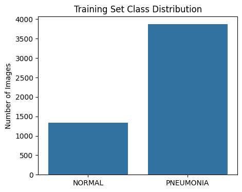
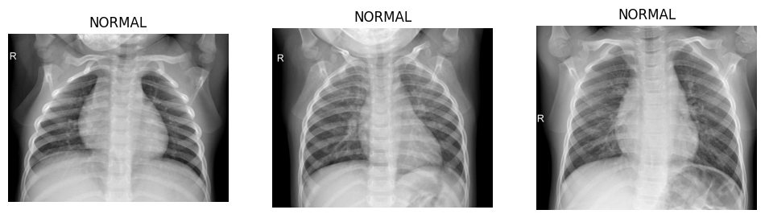
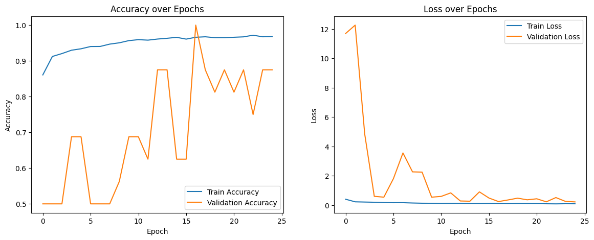
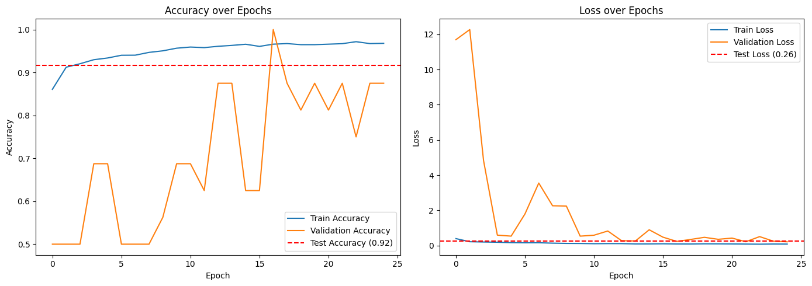
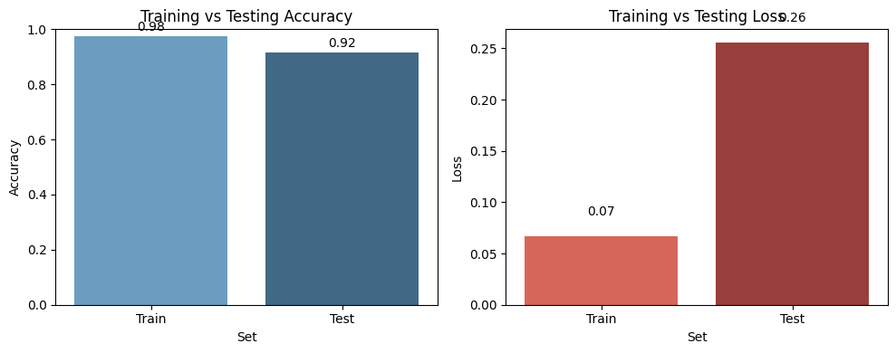
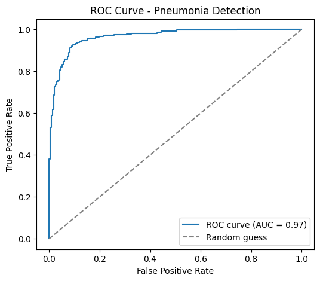
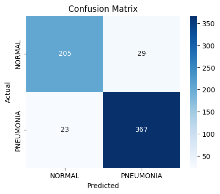

# 🫁 Pneumonia Detection Using CNN

> A deep learning project for classifying chest X-ray images into **Normal** and **Pneumonia** using a custom Convolutional Neural Network (CNN) built with TensorFlow/Keras.


---

## 📌 Overview

Pneumonia is a serious respiratory infection that can affect one or both lungs. Chest X-rays are commonly used during the diagnostic process, but interpreting medical images can be challenging and time-consuming.

This project explores the application of **Convolutional Neural Networks (CNNs)** for automated classification of chest X-ray images.

The model classifies chest X-ray images into two categories:

* 🟢 **NORMAL**
* 🔴 **PNEUMONIA**

The project covers an end-to-end deep learning workflow including:

* Dataset preparation
* Dataset verification
* Exploratory Data Analysis
* Class distribution analysis
* Image visualization
* Image preprocessing
* Image normalization
* Data augmentation
* CNN architecture development
* Class weighting
* Model training
* Model evaluation
* ROC-AUC analysis
* Confusion matrix analysis
* Classification report
* Single-image prediction

---

## 🎯 Objectives

The main objectives of this project are:

* Build a CNN-based binary image classification model.
* Classify chest X-ray images as Normal or Pneumonia.
* Preprocess and normalize medical images.
* Apply image augmentation to improve model generalization.
* Analyze dataset structure and class distribution.
* Address class imbalance using class weighting.
* Train a custom CNN architecture.
* Evaluate the model using multiple performance metrics.
* Analyze classification performance using a confusion matrix.
* Evaluate discrimination performance using ROC-AUC.
* Perform prediction on individual chest X-ray images.
* Explore the application of deep learning in medical image classification.

---

# 📊 Dataset

This project uses the **Chest X-Ray Images (Pneumonia)** dataset.

The dataset contains approximately **5,863 chest X-ray images** organized into training, validation, and test sets.

## Dataset Structure

```text
chest_xray/
│
├── train/
│   ├── NORMAL/
│   └── PNEUMONIA/
│
├── val/
│   ├── NORMAL/
│   └── PNEUMONIA/
│
└── test/
    ├── NORMAL/
    └── PNEUMONIA/
```

## Classes

| Class     | Description                   |
| --------- | ----------------------------- |
| NORMAL    | Chest X-ray without pneumonia |
| PNEUMONIA | Chest X-ray showing pneumonia |

The dataset contains an imbalanced distribution between the two classes. **Class weighting** was applied during model training to help address this imbalance.

---

# 📊 Dataset Distribution

The dataset distribution was analyzed before model training to understand:

* Number of images in each class
* Distribution across train, validation, and test sets
* Class imbalance
* Dataset composition



---

# 🖼️ Sample Chest X-Ray Images

Sample chest X-ray images were visualized to understand the differences and variations present in the dataset.



---

# 🔄 Project Workflow

```text
Chest X-Ray Dataset
        ↓
Dataset Download
        ↓
Dataset Verification
        ↓
Exploratory Data Analysis
        ↓
Class Distribution Analysis
        ↓
Image Visualization
        ↓
Image Preprocessing
        ↓
Data Augmentation
        ↓
Class Weight Calculation
        ↓
CNN Architecture
        ↓
Model Compilation
        ↓
Model Training
        ↓
Early Stopping
        ↓
Learning Rate Adjustment
        ↓
Model Checkpointing
        ↓
Model Evaluation
        ↓
Confusion Matrix
        ↓
ROC-AUC Analysis
        ↓
Classification Report
        ↓
Single Image Prediction
```

---

# 🖼️ Image Preprocessing

The chest X-ray images are prepared before being provided to the CNN model.

The preprocessing workflow includes:

* Image resizing
* Conversion to grayscale
* Pixel normalization
* Dataset verification
* Image visualization
* Training data preparation
* Validation data preparation
* Test data preparation

## Input Image Size

```text
150 × 150 × 1
```

The model uses grayscale chest X-ray images as input.

---

# 🔁 Data Augmentation

Data augmentation is applied to increase the diversity of training images and improve model generalization.

The augmentation pipeline includes:

* Rotation
* Zoom
* Shearing
* Horizontal flipping

These transformations generate variations of training images and can help reduce overfitting.

---

# 🧠 CNN Architecture

A custom **Convolutional Neural Network** is implemented using TensorFlow/Keras.

## Architecture

```text
Input
150 × 150 × 1
        │
        ▼
Conv2D
16 Filters
        │
Batch Normalization
        │
Max Pooling
        │
        ▼
Conv2D
32 Filters
        │
Batch Normalization
        │
Max Pooling
        │
        ▼
Conv2D
64 Filters
        │
Batch Normalization
        │
Max Pooling
        │
        ▼
Conv2D
128 Filters
        │
Batch Normalization
        │
Max Pooling
        │
        ▼
Flatten
        │
        ▼
Dense - 128
ReLU Activation
        │
        ▼
Dropout - 0.3
        │
        ▼
Dense - 1
Sigmoid Activation
        │
        ▼
NORMAL / PNEUMONIA
```

---

# ⚙️ Model Configuration

| Component               | Configuration       |
| ----------------------- | ------------------- |
| Programming Language    | Python              |
| Framework               | TensorFlow / Keras  |
| Model                   | Sequential CNN      |
| Input Shape             | 150 × 150 × 1       |
| Classification          | Binary              |
| Output Activation       | Sigmoid             |
| Loss Function           | Binary Crossentropy |
| Optimizer               | Adam                |
| Learning Rate           | 0.0005              |
| Main Metrics            | Accuracy, AUC       |
| Dropout                 | 0.3                 |
| Training Epochs         | Up to 25            |
| Class Weighting         | Applied             |
| Batch Normalization     | Applied             |
| Data Augmentation       | Applied             |
| Early Stopping          | Applied             |
| Learning Rate Reduction | Applied             |
| Model Checkpointing     | Applied             |

---

# 🏋️ Model Training

The CNN model is trained for up to **25 epochs**.

During training, the following metrics are monitored:

* Training Loss
* Validation Loss
* Training Accuracy
* Validation Accuracy
* Training AUC
* Validation AUC

The training process also uses:

* **Class weighting** to address class imbalance
* **Early Stopping** to reduce unnecessary training
* **ReduceLROnPlateau** to adjust the learning rate
* **ModelCheckpoint** to save the best model
* **Batch Normalization** for more stable training
* **Dropout** for regularization
* **Data Augmentation** for improved generalization

---

# 📈 Training and Validation Curves

The training history is analyzed using accuracy and loss curves.



---

# 📊 Training, Validation and Testing Performance

Training, validation, and testing performance are compared to understand model learning and generalization.





---

# 📊 Model Performance

The trained CNN model was evaluated on the held-out test dataset containing **624 chest X-ray images**.

## 🧪 Test Results

| Metric        |      Score |
| ------------- | ---------: |
| Test Accuracy | **91.67%** |
| Test AUC      | **0.9646** |
| ROC-AUC       | **0.9661** |
| Test Loss     | **0.2559** |

---

# 🏋️ Training Results

| Metric            |      Score |
| ----------------- | ---------: |
| Training Accuracy | **97.60%** |
| Training AUC      | **0.9962** |
| Training Loss     | **0.0667** |

---

# 📋 Classification Report

| Class                | Precision |   Recall | F1-Score | Support |
| -------------------- | --------: | -------: | -------: | ------: |
| NORMAL               |      0.90 |     0.88 |     0.89 |     234 |
| PNEUMONIA            |      0.93 |     0.94 |     0.93 |     390 |
| **Accuracy**         |           |          | **0.92** | **624** |
| **Macro Average**    |  **0.91** | **0.91** | **0.91** | **624** |
| **Weighted Average** |  **0.92** | **0.92** | **0.92** | **624** |

---

# 📈 ROC-AUC

The model achieved a **ROC-AUC of 0.9661**, indicating strong discrimination between Normal and Pneumonia chest X-ray images across different classification thresholds.



---

# 🔲 Confusion Matrix

The confusion matrix provides a detailed view of:

* True Positives
* True Negatives
* False Positives
* False Negatives



---

# 📉 Training vs Testing Metrics

The training and testing metrics are compared to analyze the model's generalization performance.


---

# 🔍 Key Performance Observations

* ✅ Achieved **91.67% test accuracy**.
* ✅ Achieved **0.9661 ROC-AUC**.
* ✅ Pneumonia recall reached **94%**.
* ✅ Pneumonia F1-score reached **0.93**.
* ✅ Normal class achieved **88% recall**.
* ✅ Normal class achieved **0.89 F1-score**.
* ✅ Class weighting was applied during training to address class imbalance.
* ✅ Data augmentation was used to improve generalization.
* ✅ Batch Normalization was used for more stable training.
* ✅ Dropout regularization was applied.
* ✅ Early stopping was used during training.
* ✅ Learning-rate reduction was applied.
* ✅ Model checkpointing was used.
* ⚠️ The difference between training accuracy (**97.60%**) and test accuracy (**91.67%**) indicates a generalization gap that can be further investigated.

> **Important:** These results are from this project's test dataset and should not be interpreted as clinical performance.

---

# 📊 Training & Evaluation

The notebook includes visual analysis of:

* Training vs Validation Accuracy
* Training vs Validation Loss
* Training vs Testing Accuracy
* Training vs Testing Loss
* Confusion Matrix
* ROC Curve
* Classification Report

These visualizations are used to analyze:

* Model learning
* Generalization
* Classification errors
* Class performance
* Discrimination performance

---

# 🧪 Single Image Prediction

The trained model can also classify an individual chest X-ray image.

## Prediction Pipeline

```text
Input Chest X-Ray
        ↓
Convert to Grayscale
        ↓
Resize to 150 × 150
        ↓
Normalize Pixel Values
        ↓
CNN Model
        ↓
Sigmoid Probability
        ↓
Threshold = 0.5
        ↓
NORMAL / PNEUMONIA
```

## Example Prediction

```text
Prediction: PNEUMONIA
Probability: 0.xx
```

The notebook contains examples for predicting both Pneumonia and Normal test images.

---

# 🔬 Technical Highlights

* Custom CNN built from scratch using TensorFlow/Keras
* Four convolutional blocks
* 16, 32, 64, and 128 convolutional filters
* Batch Normalization
* Max Pooling
* Flatten layer
* Dense layer with 128 neurons
* ReLU activation
* Dropout regularization
* Sigmoid output activation
* Binary classification
* Binary Crossentropy loss
* Adam optimizer
* Learning-rate reduction
* Early stopping
* Model checkpointing
* Class weighting
* Image augmentation
* Grayscale image processing
* ROC-AUC analysis
* Confusion Matrix
* Classification Report
* Single-image inference

---

# 🛠️ Technologies Used

## Programming

* Python

## Deep Learning

* TensorFlow
* Keras
* Convolutional Neural Networks

## Data Processing

* NumPy
* Pandas
* Pillow

## Visualization

* Matplotlib
* Seaborn

## Development Environment

* Google Colab
* GPU-based training

## Dataset

* Chest X-Ray Images (Pneumonia)

## Dataset Access

* Kaggle API

---

# 📁 Repository Structure

```text
Pneumonia-Detection-Using-CNN/
│
├── .gitignore
├── LICENSE
├── README.md
├── requirements.txt
│
├── Pneumonia_Detection_Using_CNN.ipynb
│
└── images/
    ├── dataset_class_distribution.png
    ├── sample_pneumonia_xray_images.png
    ├── training_validation_curves.png
    ├── training_validation_test_curves.png
    ├── training_vs_testing_metrics.png
    ├── confusion_matrix.png
    └── roc_curve.png
```

---

# 🚀 How to Run

## 1. Clone the Repository

```bash
git clone https://github.com/Sreeharistack/Pneumonia-Detection-Using-CNN.git
```

## 2. Navigate to the Project

```bash
cd Pneumonia-Detection-Using-CNN
```

## 3. Install Dependencies

```bash
pip install -r requirements.txt
```

Or install the main dependencies manually:

```bash
pip install tensorflow keras numpy pandas matplotlib seaborn pillow kaggle
```

## 4. Open the Notebook

Open:

```text
Pneumonia_Detection_Using_CNN.ipynb
```

The notebook can be executed using **Google Colab** with GPU acceleration.

## 5. Configure Kaggle

The notebook uses the Kaggle API to download the dataset.

Configure your Kaggle API credentials before running the dataset download section.

## 6. Run the Notebook

Run the notebook cells sequentially:

```text
Dataset Setup
      ↓
Data Exploration
      ↓
Dataset Verification
      ↓
Image Visualization
      ↓
Preprocessing
      ↓
Data Augmentation
      ↓
Class Weight Calculation
      ↓
CNN Construction
      ↓
Model Compilation
      ↓
Model Training
      ↓
Model Evaluation
      ↓
Performance Analysis
      ↓
Single Image Prediction
```

---

# 💡 Key Highlights

* ✅ End-to-end deep learning workflow
* ✅ Binary chest X-ray classification
* ✅ Custom CNN architecture
* ✅ Four convolutional blocks
* ✅ Batch Normalization
* ✅ Max Pooling
* ✅ Dropout regularization
* ✅ Image augmentation
* ✅ Class weighting
* ✅ Adam optimizer
* ✅ Binary Crossentropy loss
* ✅ Accuracy and AUC monitoring
* ✅ Early stopping
* ✅ Learning-rate reduction
* ✅ Model checkpointing
* ✅ Confusion Matrix evaluation
* ✅ ROC-AUC evaluation
* ✅ Classification Report
* ✅ Single-image prediction
* ✅ Kaggle dataset integration
* ✅ GPU-based training workflow

---

# 🔍 Skills Demonstrated

This project demonstrates practical experience with:

* Python
* Machine Learning
* Deep Learning
* Computer Vision
* Convolutional Neural Networks
* TensorFlow
* Keras
* Image Classification
* Medical Image Analysis
* Image Preprocessing
* Image Normalization
* Data Augmentation
* Exploratory Data Analysis
* Class Imbalance Handling
* Class Weighting
* Model Evaluation
* Hyperparameter Configuration
* Model Regularization
* ROC-AUC Analysis
* Confusion Matrix
* Classification Report
* Google Colab
* Kaggle API

---

# ⚠️ Limitations

This project is an educational deep learning project and has several limitations:

* The dataset contains class imbalance.
* The validation dataset is relatively small.
* Model performance may vary on images from different hospitals or imaging systems.
* The model has not been clinically validated.
* Performance on external datasets may differ from the training/test dataset.
* The model may not generalize to all patient populations or imaging conditions.
* The model should not be considered a replacement for professional medical diagnosis.

---

# 🔮 Future Improvements

Potential improvements include:

* Address class imbalance using additional suitable techniques.
* Improve validation strategy.
* Perform systematic hyperparameter tuning.
* Experiment with transfer learning.
* Compare architectures such as ResNet, DenseNet, EfficientNet, and MobileNet.
* Implement Grad-CAM for model explainability.
* Perform external validation using an independent dataset.
* Improve model calibration.
* Add experiment tracking.
* Build a Streamlit prediction interface.
* Develop an API for model inference.
* Deploy the trained model as a web application.
* Add automated model monitoring.
* Perform more extensive error analysis.

---

# 📚 Project Information

| Item          | Details                             |
| ------------- | ----------------------------------- |
| Project       | Pneumonia Detection Using CNN       |
| Domain        | Deep Learning / Computer Vision     |
| Task          | Binary Image Classification         |
| Input         | Chest X-Ray Image                   |
| Input Size    | 150 × 150 × 1                       |
| Classes       | NORMAL / PNEUMONIA                  |
| Model         | Custom Convolutional Neural Network |
| Framework     | TensorFlow / Keras                  |
| Environment   | Google Colab                        |
| Dataset       | Chest X-Ray Images (Pneumonia)      |
| Test Images   | 624                                 |
| Test Accuracy | 91.67%                              |
| ROC-AUC       | 0.9661                              |

---

# 📦 Project Files

## Jupyter Notebook

```text
Pneumonia_Detection_Using_CNN.ipynb
```

Contains the complete workflow for:

* Dataset preparation
* Data analysis
* Preprocessing
* Augmentation
* CNN construction
* Model training
* Evaluation
* Visualization
* Prediction

## Requirements

```text
requirements.txt
```

Contains the Python dependencies required to run the project.

## Visualizations

```text
images/
```

Contains the project's model evaluation and dataset visualization outputs.

---

# 👨‍💻 Author

## Shaam Shhanu

**Aspiring Data Scientist | Machine Learning | Deep Learning | Computer Vision**

### GitHub

https://github.com/Sreeharistack

### LinkedIn

Add your LinkedIn profile URL here.

---

# 📄 License

This project is licensed under the **MIT License**.

See the `LICENSE` file for more information.

---

# ⚕️ Medical Disclaimer

This project is intended **strictly for educational and research purposes**.

It is **not a medical diagnostic tool** and should not be used for:

* Clinical diagnosis
* Treatment decisions
* Patient care
* Medical decision-making

The model has not been clinically validated.

Any medical decision should be made by a qualified healthcare professional.

---

# ⭐ Support

If you found this project useful for learning about:

* Machine Learning
* Deep Learning
* CNN
* Computer Vision
* Medical Image Classification
* TensorFlow/Keras

please consider giving this repository a ⭐ on GitHub.

---

# 🙌 Thank You

Thank you for visiting this project!

If you have suggestions, improvements, or ideas for extending this project, feel free to open an issue or submit a pull request.

**Built with Python, TensorFlow/Keras, and Deep Learning.**
